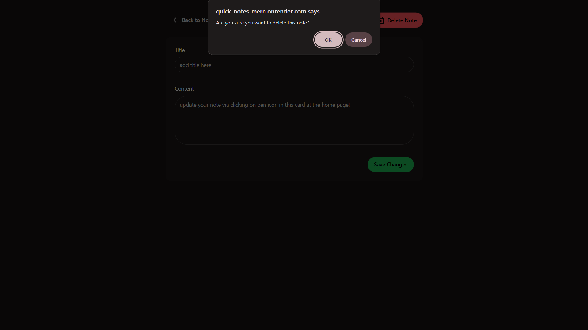

# QuickNotes 📝

## A Fully Functional MERN Stack Note-Taking Application with Rate Limiting

[]()
[](https://www.mongodb.com/mern-stack)
[](https://tailwindcss.com/)

**QuickNotes** is a fast, responsive, and secure note-taking application built on the **MERN (MongoDB, Express, React, Node.js) stack**. It provides a robust platform for users to manage their notes with complete **CRUD** (Create, Read, Update, Delete) functionality. The application features a clean, modern UI styled with **Tailwind CSS** and **DaisyUI**, and incorporates robust security by implementing API **rate limiting** using **Upstash Redis**.

---

## 💡 Key Features

The application is engineered for performance, security, and a seamless user experience:

* **Full CRUD Functionality:** Perform all core **C**reate, **R**ead, **U**pdate, and **D**elete operations on notes.
* **API Rate Limiting:** Implemented using **Upstash Redis** to protect the backend from abuse and ensure service availability.
* **Fully Responsive Design:** Optimized for perfect display on desktop, tablet, and mobile devices.
* **Modern Styling:** A clean and intuitive user interface built with the component library **DaisyUI** and the utility-first framework **Tailwind CSS**.
* **Persistent Data Storage:** Notes are securely stored and retrieved from a **MongoDB** database.

---

## 🛠 Tech Stack

QuickNotes leverages a modern, high-performance technology stack for a full-stack solution:

### Frontend
| Category | Technology | Purpose |
| :--- | :--- | :--- |
| **Library** | **React.js** | Building the dynamic and modular user interface. |
| **Styling** | **Tailwind CSS** & **DaisyUI** | Utility-first CSS framework and component library for rapid, responsive styling. |
| **Networking** | **Axios** | Efficiently making HTTP requests to the backend API. |
| **Routing** | **React Router** | Handling client-side routing for a single-page application experience. |

### Backend
| Category | Technology | Purpose |
| :--- | :--- | :--- |
| **Runtime** | **Node.js** | The server-side JavaScript runtime environment. |
| **Framework** | **Express.js** | Minimalist web framework to handle routing and middleware. |
| **Database** | **MongoDB** | A flexible NoSQL database for storing all note data. |
| **ORM** | **Mongoose** | Elegant object data modeling for MongoDB. |
| **Security/Performance** | **Upstash Redis** | Utilized for implementing a fast and reliable API rate limiting mechanism. |

---

## 🚀 Getting Started

Follow these steps to set up and run the **QuickNotes** project on your local machine.

### Prerequisites

Ensure you have the following installed:
* **Node.js** (LTS version recommended)
* **npm** or **yarn**
* Access to a **MongoDB** instance (local or Atlas)
* An **Upstash Redis** instance for the rate-limiting feature.

### Installation

1.  **Clone the Repository**
    ```bash
    git clone https://github.com/Prajwal-dev-dsa/QUICK-NOTES-MERN
    cd ../quicknotes
    ```

2.  **Setup Backend (Server)**
    ```bash
    cd ../backend # or server
    npm install
    ```
    Create a file named **`.env`** in the backend root directory and configure your environmental variables:
    ```env
    PORT=5000
    MONGO_URI="YOUR_MONGODB_CONNECTION_STRING_HERE"
    REDIS_URL="YOUR_UPSTASH_REDIS_URL_HERE" # e.g., redis://:<password>@<host>:<port>
    UPSTASH_REDIS_REST_URL="YOUR_UPSTASH_REDIS_URL_HERE" # e.g., redis://:<password>@<host>:<port>
    UPSTASH_REDIS_REST_TOKEN="YOUR_UPSTASH_REDIS_REST_TOKEN_HERE"
    ```

3.  **Setup Frontend (Client)**
    ```bash
    cd ../frontend # or client
    npm install
    ```

4.  **Run the Application**
    * **Start Backend Server:**
        ```bash
        cd ../backend
        npm run dev 
        ```
    * **Start Frontend Client:**
        ```bash
        cd ../frontend
        npm run dev
        ```
    The frontend application will typically be accessible at `http://localhost:5173`.
    The backend application will typically be accessible at `http://localhost:5000`.

---

## 🖼 Screenshots / Demo

A comprehensive visual demonstration of the QuickNotes application, showcasing the core CRUD operations, responsive design, and performance features.

### Core Functionality

| Feature | Description | Screenshot |
| :--- | :--- | :--- |
| **Front Page** | The main landing or notes display page. |  |
| **Alternative View** | A secondary view or responsive layout. |  |
| **Create Note** | Demonstration of the note creation interface. |  |
| **Update Note** | How the user edits an existing note. |  |
| **Delete Note** | The confirmation or action for deleting a note. |  |

### Performance & Security

| Feature | Description | Screenshot |
| :--- | :--- | :--- |
| **Rate Limiting** | Visual proof or indicator of the rate limiting feature in action. |  |
